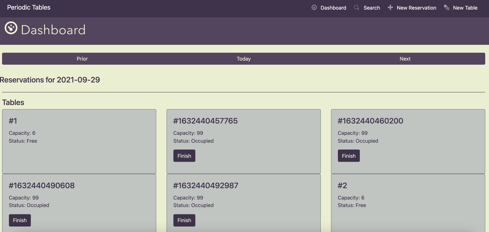
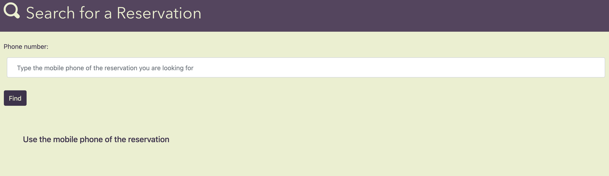
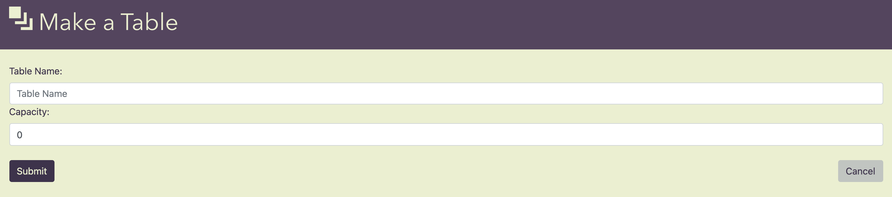
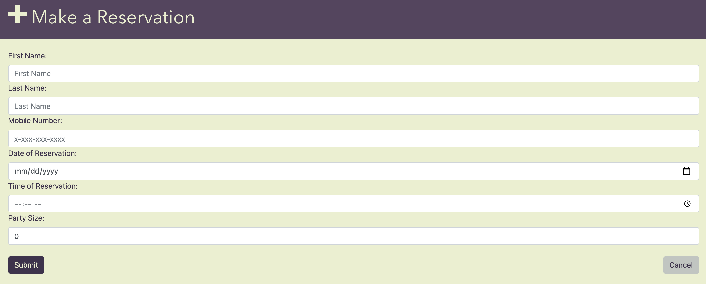
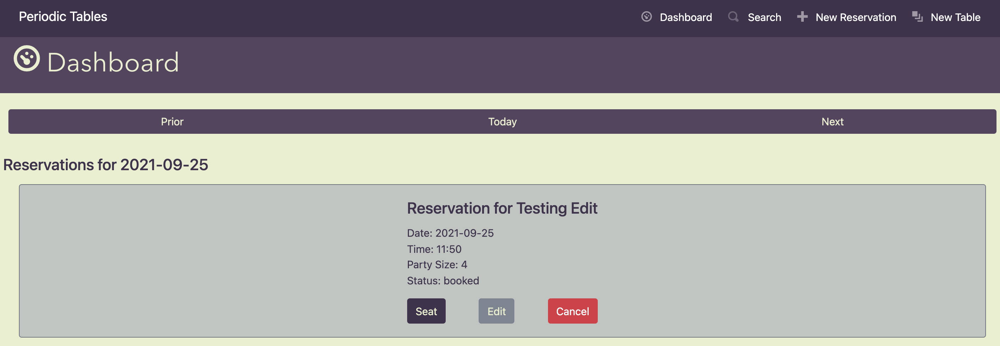
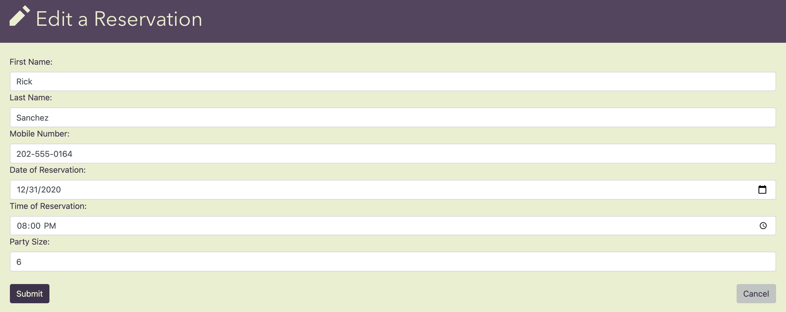
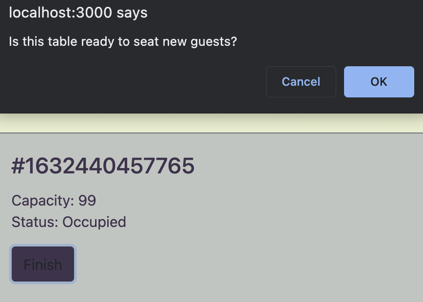
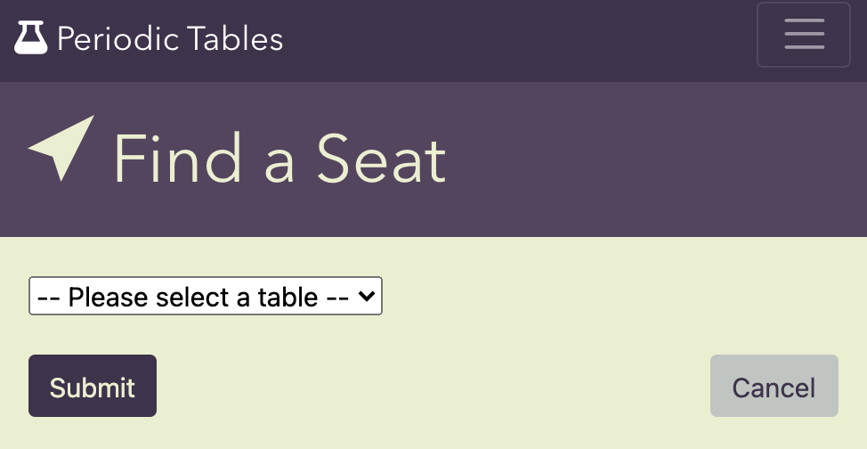

# Periodic Tables - A Restaurant Reservation Management System

## Overview

This application provides the user with a robust management system of a fictional restaurant called "Periodic Tables". The application is designed to be used by managerial staff in order to create, manage, and cancel reservations that are phoned in by customers, and it is complete with features which allow the user to create and modify reservations, seat reservations at tables, and clear tables at the end of a customer's visit. To see a deployed version of the application, click [here](http://jb-capstone-client.herokuapp.com/dashboard). 

## Files

This repository is set up as a *monorepo*, meaning that the frontend and backend projects are in one repository. \

| Folder/file path | Description                                                      |
| ---------------- | ---------------------------------------------------------------- |
| `./back-end`     | The backend project, which runs on `localhost:5000` by default.  |
| `./front-end`    | The frontend project, which runs on `localhost:3000` by default. |

## Tehnologies

This program was written using [Node.js](https://nodejs.org/), with a back-end designed using [Express.js](https://expressjs.com/), and a front-end designed using [React.js](https://reactjs.org/). Front-end styling was achieved using [Bootstrap](https://getbootstrap.com/). Additionally, PostgreSQL databases created with [ElephantSQL](https://www.elephantsql.com/) are used in this project in order to store data, with [Knex.js](https://knexjs.org/) the framework used to script the SQL queries. Starter code was provided by [Thinkful](https://github.com/Thinkful-Ed/starter-restaurant-reservation) as a part of their Engineering Flex program capstone.

## Installation

1. Fork and clone this repository.
1. Run `npm install` to install project dependencies.
1. Run `npm run start:dev` to start the server in development mode.

### Knex

Run `npx knex` commands from within the `back-end` folder, which is where the `knexfile.js` file is located.

## Running tests

This project has unit, integration, and end-to-end (e2e) tests. The application was created through user story implementation, and tests were created for each user story to ensure proper implementation. You can run the tests for a given user story by running:

`npm run test:X` where `X` is the user story number.

Have a look at the following examples:

- `npm run test:1` runs all the tests for user story 1 (both frontend and backend).
- `npm run test:3:backend` runs only the backend tests for user story 3.
- `npm run test:3:frontend` runs only the frontend tests for user story 3.

> **Note** When running `npm run test:X` If the frontend tests fail, the tests will stop before running the backend tests. 

You can run all the tests using the following commands:

- `npm test` runs _all_ tests.
- `npm run test:backend` runs _all_ backend tests.
- `npm run test:frontend` runs _all_ frontend tests.
- `npm run test:e2e` runs only the end-to-end tests.

If you would like a reminder of which npm scripts are available, run `npm run` to see a list of available commands.

Note that the logging level for the backend is set to `warn` when running tests and `info` otherwise.

> **Note**: After running `npm test`, `npm run test:X`, or `npm run test:e2e` you might see something like the following in the output: `[start:frontend] Assertion failed:`. This is not a failure, it is just the frontend project getting shutdown automatically.

> **Note**: If you are getting a `unable to resolve dependency tree` error when running the frontend tests, run the following command: `npm install --force --prefix front-end`. This will allow you to run the frontend tests.

> **Hint**: If you stop the tests before they finish, it can leave the test database in an unusual state causing the tests to fail unexpectedly the next time you run them. If this happens, delete all tables in the test database, including the `knex_*` tables, and try the tests again.

## Data Structure

The application utilizes two different structures for storing information for _reservations_ and _tables_. Here are the forms of the data for each structure:

#### Reservation
```javascript
{
  first_name: "first_name",
  last_name: "last_name",
  mobile_number: "xxx-xxx-xxxx",
  reservation_date: "YYYY-MM-DD",
  reservation_time: "HH:MM:SS",
  people: "integer",
  created_at: "timestamp",
  updated_at: "timestamp"
}
```

#### Table
```javascript
{
  table_name: "table_name",
  capacity: "integer",
  reservation_id: "defaults to null"
}
```

## API Documentation

The application involves performing CRUDL operations to manipulate the tables and reservations objects stored in the PostgreSQL database. Here is an overview of the different API calls which can be made:

|          Function            |              Arguments               | HTTP Verb |           Returns            |                        Description                              | 
|------------------------------|--------------------------------------|-----------|------------------------------|-----------------------------------------------------------------|
|  `listReservations()`        |  params, signal                      |  GET      |  `{Promise<[reservations]>}` |  Retrieves reservations based on passed params                  |
|  `listTables()`              |  signal                              |  GET      |  `{Promise<[reservaitons]>}` |  Retrieves tables based on url params                           |
|  `findReservation()`         |  reservation_id, signal              |  READ     |  `{Promise<[reservation]>}`  |  Retrieves a reservation with reservation_id matching argument  |
|  `editReservation()`         |  reservation, reservation_id, signal |  PUT      |  `{Promise<[reservation]>}`  |  Updates a reservation based on user input                      |
|  `createReservation()`       |  reservation, signal                 |  POST     |  `{Promise<[table]>}`        |  Creates a new reservation object in the database               |
|  `createTable()`             |  table, signal                       |  POST     |  `{Promise<[table]>}`        |  Creates a new table object in the database                     |
|  `updateReservationStatus()` |  reservation_id, status, signal      |  PUT      |  `{Promise<[reservation]>}`  |  Updates a reservation with a passed in status                  |
|  `assignReservation()`       |  reservation_id, table_id, signal    |  PUT      |  `{Promise<[table]>}`        |  Assigns a reservation_id to be updated into the relevant table |
|  `unassignReservation()`     |  table_id, signal                    |  DELETE   |  `{Promise}`                 |  Removes a reservation_id from a table                          |

In order to help illustrate the practical use of each API call, the following will walk through all of the API calls that a user can initiate.

When a user first arrives on the dashboard of the application, `listReservations()` and `listTables()` will be called in order to display all available tables and all reservations corresponding to the date specified in the url params. 



If a user wants to search for a reservation by mobile phone number, they can click on the **Search** button in the navbar, and the user will be navigated to **/reservations/search**. Upon arrival, a user may search for a reservation by phone number, and upon request submission, `listReservations()` will be called with the user-input number passed through params.



If a user wishes to create a new table or reservation, they may click on **New Table** or **New Reservation** to do so, and the user will be navigated to **/tables/new** or **/reservations/new**, respectively, where they may fill out forms which, upon submission, call `createTable()` and `createReservation()` respectively.




For a given reservation, a user may perform different actions. A user may cancel a reservation by pressing the **Cancel** button, which will call `udpdateReservationStatus()` with the status of 'finished', which will then prevent the reservation from being displayed when `listReservations()` is called. 



A reservation may also be edited by pressing the **Edit** button, which will then navigate the user to **/reservations/:reservation_id/edit**, which allows the user to modify the details of the reservation. Upon submission of any modifcation, the `editReservation()` call will be made. 



If a reservation has not already been assigned to a table, it may be 'seated' through using the **Seat** button, which will navigate the user to **/reservations/:reservation_id/seat**, which allows the user to choose from a selection of available tables to which to assign the reservation. 


Upon selection, `updateReservationStatus()` is called to set the status of the reservation to 'seated', and the `assignReservation()` call is made, which assigns the reservation_id to the appropriate table.



Finally, in the event that a table has a reservation seated with it, that table may be freed up to allow for a new reservation to be present there by pressing the **Finish** button, which calls `unassignReservation()`, which clears the reservation_id of the table in question to 'free' the table up for another reservation to be seated there. Changing the reservation's status upon unassignment is also achieved with this API call on the backend.


